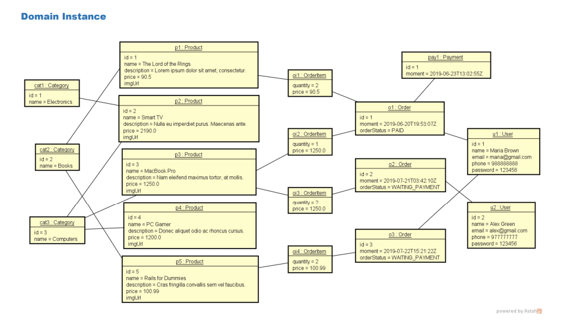

# Spring API Rest

<p align="center">
  
  
  
  
</p>


---

## 📌 Sobre o Projeto | About the Project

🇧🇷 **Português**

Este projeto foi desenvolvido como estudo para criação de uma API REST de uma loja virtual. O objetivo principal foi colocar em prática conceitos essenciais como:

- Requisições HTTP
- APIs REST
- Persistência de dados com banco relacional
- JPA / Hibernate
- Arquitetura em camadas com Spring Boot

---

🇺🇸 **English**

This project was developed as a study to build a REST API for a virtual store.  
Its goal is to practice concepts such as:

- HTTP requests
- RESTful APIs
- Relational database persistence
- JPA / Hibernate
- Layered architecture with Spring Boot

---

## 🚀 Tecnologias | Technologies

- Java
- Spring Boot
- Spring Data JPA
- Hibernate
- Maven

---

## 📂 Estrutura | Structure

| Diretório / Directory | Descrição / Description |
|----------------------|------------------------|
| **Controller** | Endpoints da API / API endpoints |
| **Service** | Lógica de negócio e ponte entre camadas / Business layer |
| **Repositories** | Comunicação com o banco / Database access |
| **Entities** | Objetos do domínio / Domain entities |
| **Exceptions** | Tratamento de erros / Exception handling |

---

## 🏛️ Modelo de Domínio | Domain Model

| Modelo | Instância |
|--------|-----------|
|  |  |

---

## ▶️ Como executar | How to run

⚠️ Pré-requisitos / Requirements: Java 17+ e Maven instalado

```bash
# 1 - Clonar o repositório / Clone the repository
git clone git@github.com:felipeporceli/springboot-and-jpa.git

# 2 - Entrar no diretório / Enter folder
cd springboot-and-jpa/

# 3 - Verificar Maven / Check Maven installation
mvn -v

# 4 - Executar / Run the application
mvn spring-boot:run
